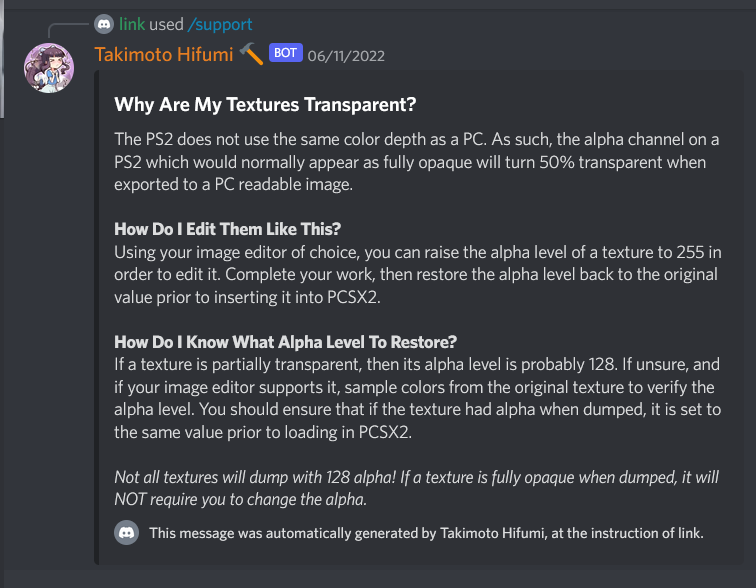
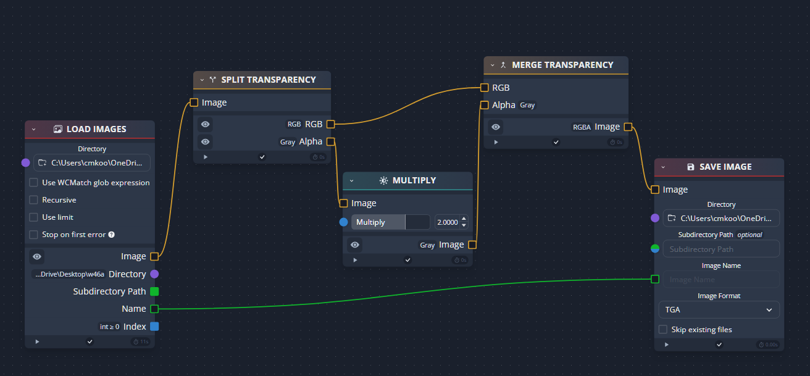
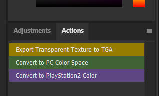
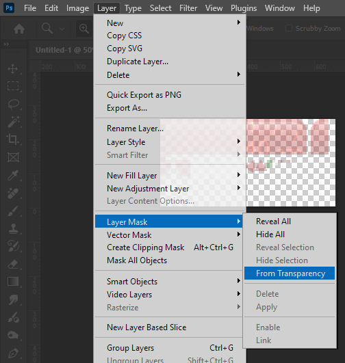
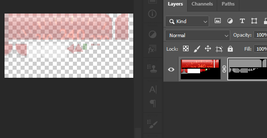
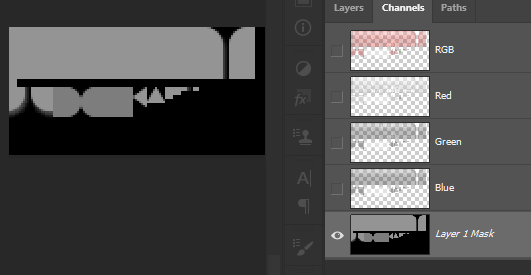
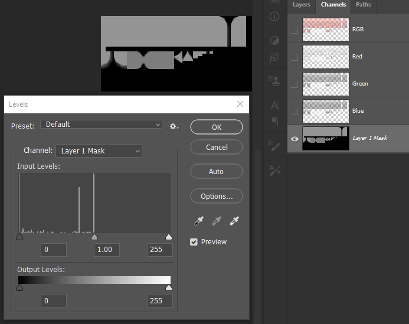
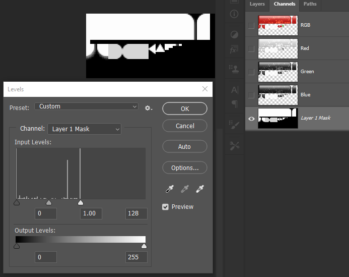
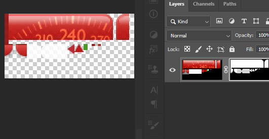
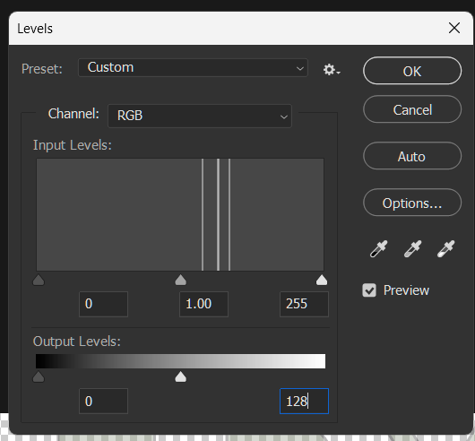

- [PS2 Texture Color Space](#ps2-texture-color-space)
	- [From PCSX2's own documentation on texture dumping](#from-pcsx2s-own-documentation-on-texture-dumping)
	- [Chainner](#chainner)
	- [Photoshop](#photoshop)
		- [Manual Method / Explanation of What the Actions Do:](#manual-method--explanation-of-what-the-actions-do)

# PS2 Texture Color Space
The PS2 had a different color depth from modern systems, and as a result, fully opaque textures from the PS2 show up as having 50% opacity on PC.

- Pixels that have 128 (50%) opacity were actually fully opaque on PS2, pixels that are 102 (40%) opacity were 80% on the PS2, 64 (25%) is 50%, ect.
- All ports of MGS2 to non-PS2 systems have code that automatically double the opacity level to account for the difference in rendering on other systems.
- Stripping opacity outright from a texture / setting it to 100% / fully opaque via photoshop will result in MGS2's lighting engine treating the texture completely different.

Below are tools and methods for converting texture color space for accurate rendering in modern game engines & image editors

 
 

## From PCSX2's own documentation on texture dumping

> Why Are My Textures Transparent?
> The PS2 does not use the same color depth as a PC. As such, the alpha channel on a PS2 which would normally appear as fully opaque will turn 50% transparent when exported to a PC readable image.
> 
> How Do I Edit Them Like This?
> Using your image editor of choice, you can raise the alpha level of a texture to 255 in order to edit it. Complete your work, then restore the alpha level back to the original value prior to inserting it into PCSX2.
> 
> How Do I Know What Alpha Level To Restore?
> If a texture is partially transparent, then its alpha level is probably 128. If unsure, and if your image editor supports it, sample colors from the original texture to verify the alpha level. You should ensure that if the texture had alpha when dumped, it is set to the same value prior to loading in PCSX2.

 

PCSX2's team does provide tooling on their repo to easily mass-convert dumped textures to a modern color depth if you need to use the textures in a different engine:
https://github.com/PCSX2/pcsx2/blob/master/tools/texture_dump_alpha_scaler.py

 

## Chainner

Alternatively, if you're not comfortable with command line / python, you can also use chainner to easily do it en-masse (just remember to convert them back if you intend to use the texture in the MGS2/MGS3 engine!)

 

## Photoshop 

To easily convert a texture's color space directly within Photoshop, a set of actions are available here to automate the process: 

 

 

---

### Manual Method / Explanation of What the Actions Do:
1) Creates a New Layer
2) Merges all visible layers
3) Creates new layer mask from transparency
   

4) Enables ONLY the alpha channel
   

5) Menu Image > Adjustments > Levels (CTRL + L)
   

6) Change Input Level from 255 to 128 

Final Result:

 

To convert a texture from PC color space back to the PS2's color space, simply repeat the above process, but change the OUTPUT level to 128 instead of the input level.

