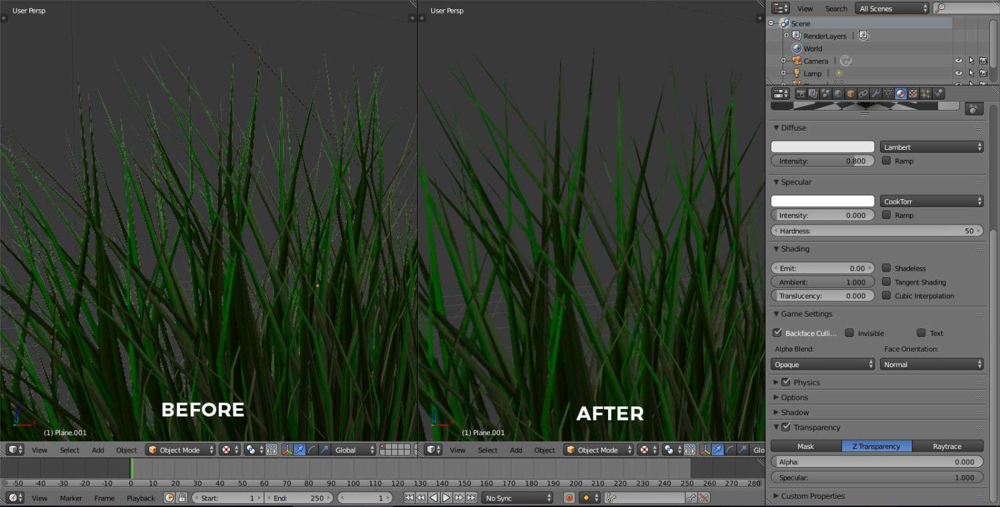
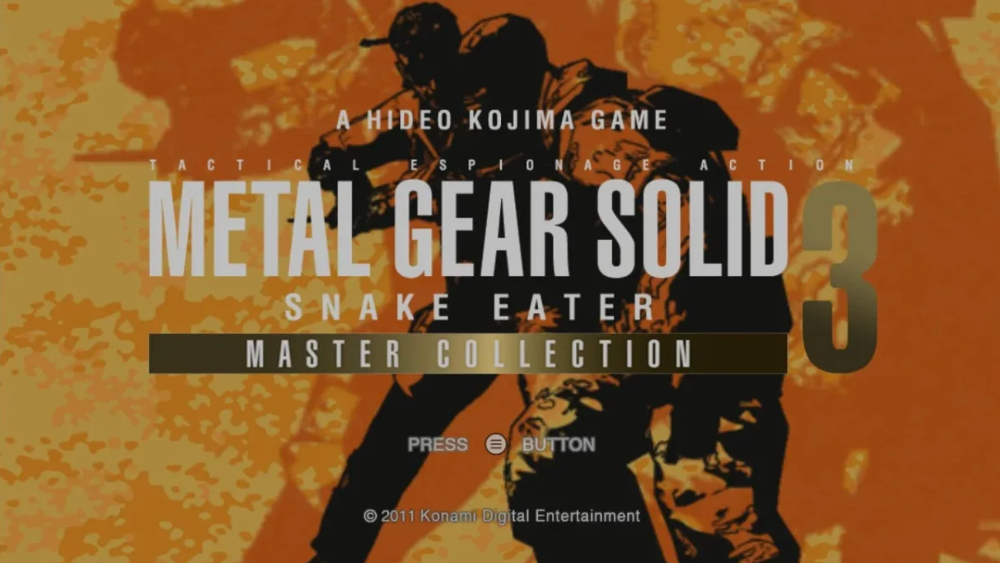

NOTICE: The below notes are still in a raw copy/pasted state and needs to be formatted.

by the way i'm assuming folks here are likely using photoshop for this project - just know that if you're working with textures that have transparencies (ie fonts), you will NOT want to export them to PNG using photoshop as you will most likely have a white halo around the edges due to a quirk with how photoshop handles transparencies. 

Don't use photoshop when exporting textures that have transparency / alpha layers - use gimp instead (it can also open PSD's, that said it doesn't respect photoshop's layer blending color overlay options so be sure to make things the actual color you want.)

This is a long known issue with how photoshop saves images with transparency, in that it sets empty pixels to white instead of bleeding the color that is adjacent to them. This results in white edges appearing around transparent textures due to how most game engines compress textures in memory, even though the image itself looks normal when viewed in photoshop & windows. 

To fix this issue, simply open up your .PSD (or your .PNG) in gimp, export as a PNG (control shift e to open the export panel), then enable this option when saving the file as a PNG
