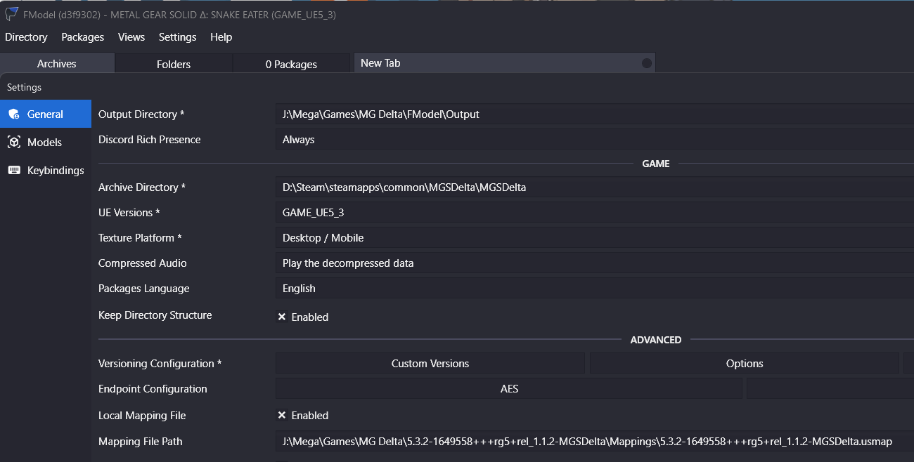

# 2025 - Metal Gear Solid Delta (Multiplatform)
Initial Release Date: 26AUG2025

## Table of Contents
```table-of-contents
```

## .PAK Extraction
[FModel](https://fmodel.app/)

[Fmodel Mapping Files](https://www.nexusmods.com/metalgearsoliddeltasnakeeater/mods/20?tab=description)
#### Usage:



## .PAK Creation
[Mod Packaging with UnrealPak](https://modding.wiki/en/stalker2heartofchornobyl/developers/UnrealPak)


## Texturing / Models
Models are standard .FBX format.

Textures are Albedo, Metalness/Roughness/Ambient/Occlusion (MRAO) Maps, Cavity/Detail/Displacement Maps (CDM), Normals, Blendmaps, and Masks for dirt & decals.

Modern texturing (Adobe Substance Painter) & modeling (Autodesk Maya) software can be used without any modification.